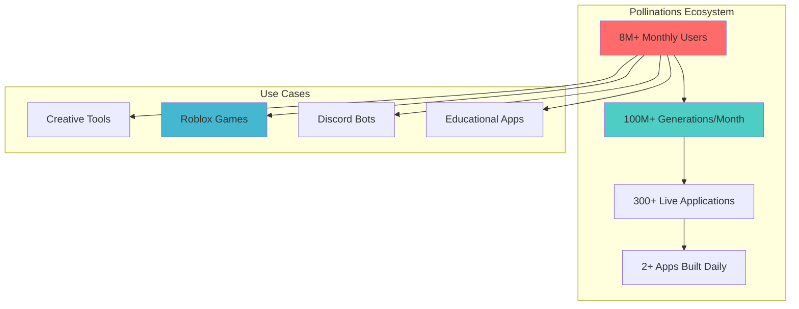
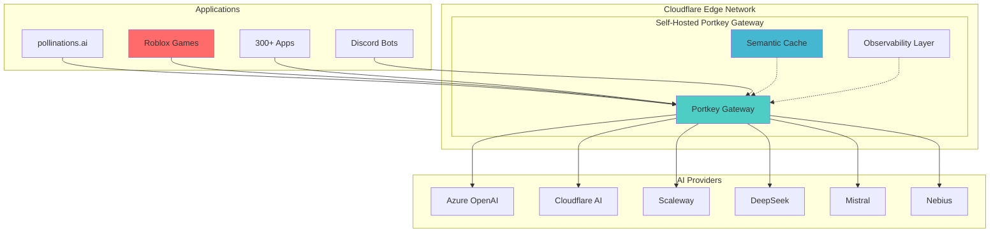
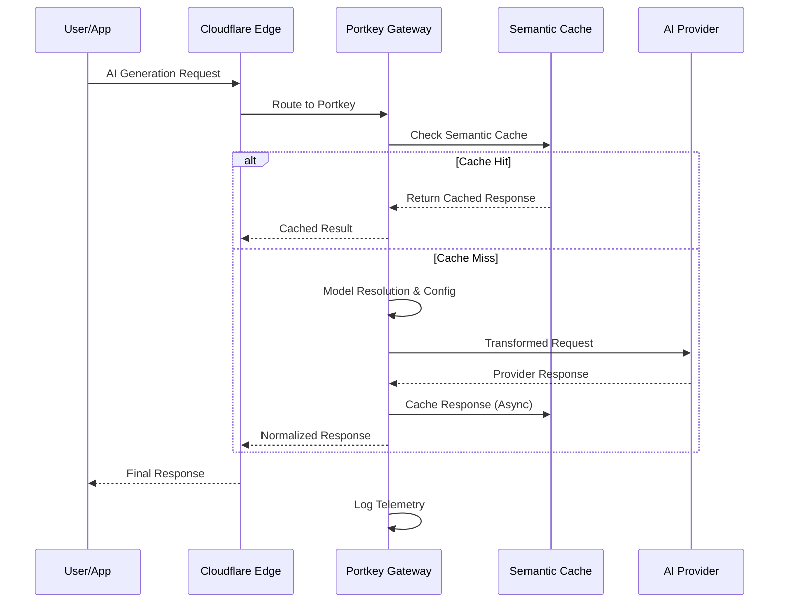
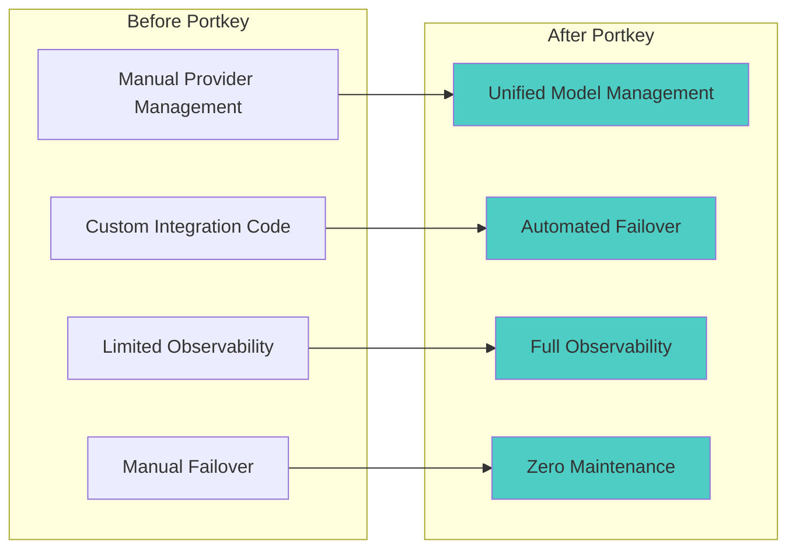
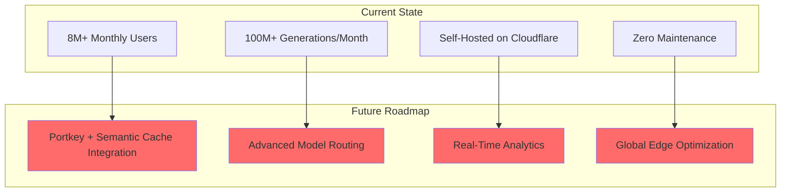

# How Pollinations Scales AI Infrastructure for 8+ Million Users with Portkey's Unified LLM Gateway

*A technical case study on building resilient, multi-provider AI infrastructure at scale*

---

## Executive Summary

Pollinations.AI, a **fully open-source** generative AI platform based in Berlin, serves over 8 million monthly active users through a unified API that requires no signups or API keys. To manage this scale across 50+ LLM models from multiple providers, Pollinations implemented Portkey as their centralized AI gateway, **self-hosted on Cloudflare's edge network**. This case study explores how Portkey's robust self-hosting capabilities enable Pollinations to maintain exceptional uptime while serving 100+ million AI generations monthly through automated failover, intelligent routing, and comprehensive observability.

## The Challenge: Scaling Multi-Provider AI Infrastructure at Internet Scale

Pollinations.AI has built one of the world's most accessible AI platforms, powering everything from creative applications to **conversational Roblox games with 2+ million monthly active users**. With no authentication barriers and completely free access, the platform faces unique scaling challenges:

### Scale & Complexity Challenges:
- **Massive Scale**: 8+ million monthly active users generating 100+ million pieces of content
- **Provider Complexity**: Managing 50+ models across Azure OpenAI, Cloudflare Workers AI, Scaleway, DeepSeek, Mistral, and others
- **Zero Downtime Requirements**: No authentication means users expect instant, reliable access
- **Cost Optimization**: Balancing performance with operational efficiency across multiple providers
- **Rapid Innovation**: Need to quickly integrate new models and providers as they become available
- **Global Distribution**: Serving users worldwide with sub-second response times Complexity
- **Provider-specific APIs**: Each LLM provider has different authentication, endpoints, and request formats
- **Model routing logic**: Dynamic selection based on user tier, model availability, and cost
- **Failover requirements**: Automatic fallback when providers experience outages or rate limits
- **Observability needs**: Comprehensive logging across all providers for debugging and optimization
- **Configuration management**: Maintaining 50+ model configurations across multiple environments

## A System That Manages LLMs, End-to-End

To efficiently handle this vast operation, Pollinations has developed a unified ecosystem that automates model routing, authentication, and observability across all LLM providers.

Their team built a comprehensive AI infrastructure using Portkey to manage all LLM interactions. Every model request is processed through this system, regardless of the underlying provider.

Here's an overview of how requests flow through the system:

### 1. Request Reception and Model Resolution
When a user makes a request, the system receives it at the text.pollinations.ai service. The first step is mapping the user-facing model name (like "openai-large") to the actual provider-specific model configuration.

### 2. Provider Configuration and Authentication  
Based on the requested model, the system dynamically selects the appropriate provider configuration. This includes setting up authentication, endpoints, and provider-specific parameters for Azure OpenAI, Cloudflare Workers AI, Scaleway, or other providers.

### 3. Intelligent Request Transformation
The system automatically transforms requests to match each provider's specific API requirements. Azure requests get resource names and deployment IDs, Cloudflare requests get account information, and so on - all handled transparently.

### 4. Portkey Gateway Routing
All requests are routed through Portkey's unified gateway, which handles the actual communication with each provider while maintaining comprehensive logging and observability.

### 5. Response Processing and Streaming
Responses are streamed back through the same unified interface, providing consistent behavior regardless of which provider actually processed the request.

Each of these steps is handled automatically, and every LLM call goes through Portkey. The system currently manages 50+ different model configurations across multiple providers.

## The Portkey Solution: Self-Hosted Unified AI Gateway

Pollinations chose Portkey to create a unified abstraction layer over their multi-provider AI infrastructure, **self-hosting the gateway on Cloudflare's edge network**. This deployment strategy provides global distribution and exceptional reliability - **the system has required zero maintenance since deployment**.

### Core Architecture Components

**Self-Hosted on Cloudflare**
By deploying Portkey on Cloudflare's edge network, Pollinations achieves global distribution with minimal latency. As a **fully open-source platform**, Pollinations deeply appreciates Portkey's **robust and easy-to-self-host system** that allows them to maintain full control while scaling efficiently. The system has proven remarkably stable, requiring **no maintenance interventions since initial deployment**.

**Model Abstraction Layer**
Portkey enables Pollinations to present user-friendly model names while mapping them to provider-specific implementations. Users can request "openai-fast" or "llama" without needing to understand the underlying provider complexities.

**Dynamic Provider Configuration**
The system maintains hot-swappable configurations for each AI provider, allowing Pollinations to adjust endpoints, authentication, and routing rules without service interruption.

**Request Transformation Pipeline**
All incoming requests are transformed into provider-specific formats, with Portkey handling the differences in API schemas, authentication methods, and response formats.

**Advanced Semantic Caching**
Pollinations has implemented sophisticated semantic caching with dynamic thresholds and rolling statistics, with plans to integrate this directly into Portkey for even better performance optimization.

## Implementation Deep Dive: Request Flow Architecture

The Pollinations-Portkey integration follows a streamlined workflow that transforms every user request into a successful AI generation, whether it's powering a creative tool or enabling **real-time conversations in Roblox games**:

### 1. Request Reception & Edge Routing
Requests from any Pollinations interface - the main website, **Roblox games with 2M+ monthly users**, or 300+ third-party applications - are received at Cloudflare's edge network and routed to the self-hosted Portkey gateway.

### 2. Semantic Cache Check
Before processing, the system checks Pollinations' advanced semantic caching layer, which uses **dynamic thresholds and rolling statistics** to optimize cache hit rates while maintaining response quality.

### 3. Model Resolution & Provider Selection
The system maps user-facing model names to provider-specific implementations and selects the optimal provider based on real-time availability and performance metrics.

### 4. Request Transformation & Routing
Portkey transforms requests into provider-specific formats and routes them with automatic failover capabilities, ensuring **99.9%+ uptime** even during provider outages.

### 5. Response Processing & Caching
Provider responses are normalized and asynchronously cached using semantic embeddings, while comprehensive telemetry enables continuous system optimization.

### Real-World Impact: Roblox Success Story
This architecture powers **"AI Character RP"** - currently the **#1 AI game on Roblox** with over **2 million monthly active users**. The game demonstrates real-time conversational AI at massive scale, with Pollinations and the developer sharing revenue through a custom arrangement that validates the platform's business model.

## Operational Benefits: Zero-Touch Scaling at Internet Scale

The self-hosted Portkey integration has delivered exceptional operational benefits, enabling Pollinations to scale from startup to **8+ million monthly users** with minimal infrastructure overhead:

### Zero-Maintenance Operations
Since deploying Portkey on Cloudflare, **the system has required absolutely no maintenance interventions**. This "set it and forget it" reliability has been crucial for Pollinations' lean team to focus on product development rather than infrastructure management.

### Unified Model Management
By abstracting provider complexities behind Portkey's unified interface, Pollinations can rapidly integrate new models and providers. The team recently added support for **OpenAI's O3 Mini** within hours of its release, demonstrating the platform's agility.

### Full Observability Across 100M+ Generations
Portkey's comprehensive monitoring provides unprecedented visibility into system performance across **100+ million monthly generations**. The team can track request patterns, identify bottlenecks, and optimize routing decisions based on real-time data.

### Automated Resilience for Critical Applications
The system automatically handles provider outages and rate limits without manual intervention, crucial for supporting **real-time Roblox games** where any downtime directly impacts user experience and revenue.

### Rapid Experimentation at Scale
The modular architecture enables A/B testing of different models and providers without affecting production stability. This capability is essential for supporting Pollinations' **2+ new applications launching daily**.

### Advanced Semantic Caching Strategy
Pollinations has implemented sophisticated semantic caching with **dynamic thresholds and rolling statistics**, with plans to integrate this technology directly into Portkey for even better performance optimization across their 50+ model ecosystem.

## Key Lessons and Future Roadmap

Pollinations' experience scaling to **8+ million users** with self-hosted Portkey offers valuable insights for organizations building AI infrastructure at internet scale:

### Start with Self-Hosted Infrastructure
Deploying Portkey on Cloudflare's edge network has provided **exceptional reliability with zero maintenance overhead**. This approach gives Pollinations full control while leveraging Cloudflare's global distribution.

### Prioritize Semantic Intelligence
Pollinations' advanced semantic caching implementation with **dynamic thresholds and rolling statistics** demonstrates the importance of intelligent caching strategies. Plans to integrate this directly into Portkey will further optimize performance.

### Design for Viral Growth
The architecture successfully supports **viral applications like Roblox games** that can scale from zero to millions of users overnight. Automated failover and edge distribution are essential for handling traffic spikes.

### Enable Real-Time Interactions
Supporting **conversational AI in games** requires sub-second response times and 99.9%+ uptime. The Portkey integration enables real-time AI interactions that feel natural to users.

### Build for Ecosystem Growth
With **300+ live applications and 2+ new ones launching daily**, the platform demonstrates how robust infrastructure enables ecosystem growth and innovation.

### Looking Forward: Semantic Cache Integration & Managed Migration
Pollinations plans to integrate their sophisticated semantic caching technology directly into Portkey, creating an even more intelligent and efficient AI gateway that could benefit the entire Portkey ecosystem. **As the company grows and generates more revenue, they're also considering migrating to Portkey's managed solution** - a natural evolution that would allow them to focus even more on product development while leveraging Portkey's enterprise-grade managed infrastructure.

*"Portkey has been absolutely solid since we deployed it on Cloudflare - we literally haven't touched it since launch. It just works. As an open-source platform, we're incredibly grateful for Portkey's robust self-hosting capabilities that let us maintain full control while scaling to 8+ million users. When new models like O3 Mini come out, we can integrate them in hours, not weeks. That agility is crucial when you're supporting everything from creative tools to real-time Roblox games with millions of users. As we grow, we're excited about potentially moving to Portkey's managed solution."*

**— Thomas Haferlach, Co-founder, Pollinations.AI**

---

## Conclusion: Scaling AI Infrastructure for the Next Generation

Pollinations' implementation of self-hosted Portkey demonstrates how thoughtful infrastructure decisions enable exponential growth while maintaining operational simplicity. By serving **8+ million monthly users** across **300+ applications** - from creative tools to **viral Roblox games** - Pollinations has proven that the right AI gateway can scale from startup to internet-scale platform.

The combination of **zero-maintenance operations**, **advanced semantic caching**, and **real-time conversational AI** capabilities showcases what's possible when infrastructure truly gets out of the way of innovation. As AI continues to power more interactive and real-time applications, having a flexible, observable, and resilient foundation becomes not just an advantage, but a necessity.

For organizations building the next generation of AI-powered applications - whether creative tools, games, or conversational interfaces - the Pollinations case study provides a blueprint for scaling AI infrastructure that can grow from prototype to platform without breaking.

*Ready to scale your AI infrastructure with Portkey? Learn more at [portkey.ai](https://portkey.ai)*
